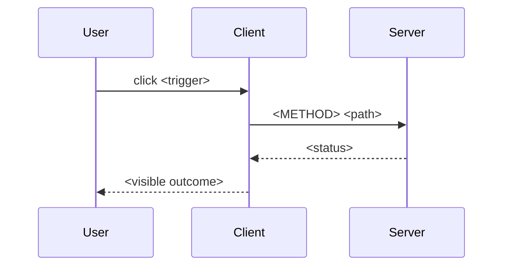

# Action flow — F1 (copy into chat)

```
[flow-builder F1]
Scope: <trigger> on <screen>
Action flow — <short title>

## Trigger
| Field | Value |
| Trigger | <button / link / submit / route enter> |
| Screen | <page / modal / component> |
| Preconditions | <logged in, form valid, …> |

## Steps (happy path)
| # | Actor | Action | System response | Notes |
| 1 | User | … | … | |
| 2 | Client | … | … | validate / loading |
| 3 | API | … | … | method path |
| 4 | UI | … | … | toast / redirect / close modal |

## Mermaid (sequence)


## Open questions
| # | question | default assumption |
| 1 | … | … |
```
